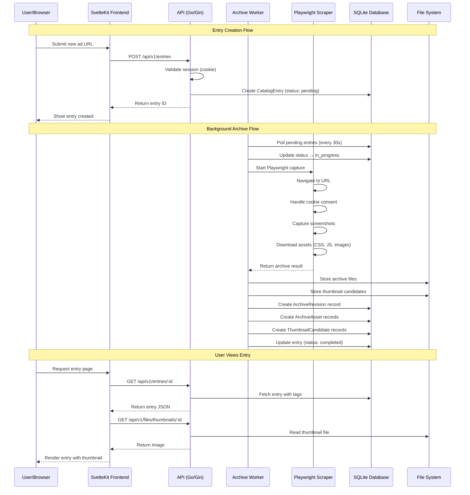

# AdHive Architecture Overview

> **Target Audience:** Developers onboarding to the AdHive codebase

This document explains how AdHive's components work together, the key design decisions, and the data flow through the system.

---

## Table of Contents

1. [System Overview](#system-overview)
2. [Architecture Diagram](#architecture-diagram)
3. [Components](#components)
   - [Backend (Go + Gin)](#backend-go--gin)
   - [Frontend (SvelteKit)](#frontend-sveltekit)
   - [Database (SQLite + GORM)](#database-sqlite--gorm)
   - [Scraper (Playwright)](#scraper-playwright)
4. [Data Flow](#data-flow)
5. [Key Design Decisions](#key-design-decisions)
6. [Security Considerations](#security-considerations)
7. [File Structure Reference](#file-structure-reference)

---

## System Overview

AdHive is a **classified ads catalog system** that allows users to:

- Save and organize classified advertisements from URLs
- Automatically archive web pages (full fidelity capture)
- Extract metadata (title, phone, location, thumbnails)
- Tag and search entries
- Track interactions (tried, scored, notes)

The system follows a **layered architecture** pattern with clear separation between:
- **Handlers** (HTTP layer) → **Services** (business logic) → **Repositories** (data access)

---

## Architecture Diagram

```
┌─────────────────────────────────────────────────────────────────────────┐
│                              CLIENT LAYER                                │
├─────────────────────────────────────────────────────────────────────────┤
│                                                                          │
│   ┌─────────────────┐         ┌─────────────────┐                       │
│   │   SvelteKit      │         │   REST API      │                       │
│   │   Frontend       │ ◄─────► │   Consumers     │                       │
│   │   (TypeScript)   │         │   (curl, etc)   │                       │
│   └────────┬────────┘         └────────┬────────┘                       │
│            │                           │                                 │
└────────────┼───────────────────────────┼─────────────────────────────────┘
             │                           │
             ▼                           ▼
┌─────────────────────────────────────────────────────────────────────────┐
│                            API LAYER (Go/Gin)                            │
├─────────────────────────────────────────────────────────────────────────┤
│                                                                          │
│   ┌──────────────┐  ┌──────────────┐  ┌──────────────┐  ┌─────────────┐ │
│   │    Auth      │  │    Entry     │  │     Tag      │  │   Archive   │ │
│   │   Handler    │  │   Handler    │  │   Handler    │  │   Handler   │ │
│   └──────┬───────┘  └──────┬───────┘  └──────┬───────┘  └──────┬──────┘ │
│          │                 │                  │                  │        │
│   ┌──────┴───────┐  ┌─────┴──────┐  ┌───────┴──────┐  ┌───────┴──────┐ │
│   │    Auth      │  │   Entry    │  │     Tag      │  │   File       │ │
│   │  Middleware  │  │  Service   │  │   Service    │  │   Handler    │ │
│   └──────────────┘  └────────────┘  └──────────────┘  └──────────────┘ │
│                                                                          │
└─────────────────────────────────────────────────────────────────────────┘
             │
             ▼
┌─────────────────────────────────────────────────────────────────────────┐
│                         SERVICE LAYER (Business Logic)                   │
├─────────────────────────────────────────────────────────────────────────┤
│                                                                          │
│   ┌──────────────┐  ┌──────────────┐  ┌──────────────┐  ┌─────────────┐ │
│   │   Metadata    │  │ Thumbnail    │  │  Playwright  │  │  Archive   │ │
│   │   Extractor   │  │   Service    │  │   Service    │  │  Bundler   │ │
│   └──────────────┘  └──────────────┘  └──────────────┘  └─────────────┘ │
│                                                                          │
│   ┌──────────────┐  ┌──────────────┐  ┌──────────────┐                  │
│   │    File       │  │   Consent    │  │   Archive    │                  │
│   │   Service     │  │   Stripper   │  │   Rewriter   │                  │
│   └──────────────┘  └──────────────┘  └──────────────┘                  │
│                                                                          │
└─────────────────────────────────────────────────────────────────────────┘
             │
             ▼
┌─────────────────────────────────────────────────────────────────────────┐
│                         WORKER LAYER (Background Jobs)                   │
├─────────────────────────────────────────────────────────────────────────┤
│                                                                          │
│   ┌─────────────────────────────────────────────────────────────────┐   │
│   │                     Archive Worker                               │   │
│   │  • Polls pending entries (30s interval)                          │   │
│   │  • Spawns Playwright captures                                    │   │
│   │  • Extracts metadata & thumbnails                                │   │
│   │  • Creates archive revisions                                     │   │
│   └─────────────────────────────────────────────────────────────────┘   │
│                                                                          │
└─────────────────────────────────────────────────────────────────────────┘
             │
             ▼
┌─────────────────────────────────────────────────────────────────────────┐
│                         DATA LAYER (SQLite + GORM)                       │
├─────────────────────────────────────────────────────────────────────────┤
│                                                                          │
│   ┌──────────────┐  ┌──────────────┐  ┌──────────────┐  ┌─────────────┐ │
│   │     User      │  │    Entry     │  │     Tag      │  │ Interaction │ │
│   │  Repository   │  │  Repository  │  │  Repository  │  │ Repository  │ │
│   └──────┬───────┘  └──────┬───────┘  └──────┬───────┘  └──────┬──────┘ │
│          │                 │                  │                  │        │
│   ┌──────┴───────┐  ┌─────┴──────┐  ┌───────┴──────┐  ┌───────┴──────┐ │
│   │   Archive    │  │   Archive  │  │   Thumbnail   │  │   Session    │ │
│   │  Revision    │  │    Asset    │  │   Candidate   │  │  Repository  │ │
│   │  Repository   │  │ Repository  │  │  Repository   │  └─────────────┘ │
│   └──────────────┘  └─────────────┘  └───────────────┘                   │
│                                                                          │
└─────────────────────────────────────────────────────────────────────────┘
             │
             ▼
┌─────────────────────────────────────────────────────────────────────────┐
│                         STORAGE LAYER (File System)                      │
├─────────────────────────────────────────────────────────────────────────┤
│                                                                          │
│                         data/                                           │
│                         ├── archives/                                    │
│                         │   └── {entry-id}/                             │
│                         │       ├── rev-{timestamp}/                     │
│                         │       │   ├── index.html                        │
│                         │       │   └── assets/                          │
│                         └── thumbnails/                                  │
│                             └── {entry-id}/                              │
│                                 └── {uuid}.webp                          │
│                                                                          │
└─────────────────────────────────────────────────────────────────────────┘
```

### Data Flow Sequence



---

## Components

### Backend (Go + Gin)

**Location:** `cmd/server/main.go`, `internal/`

The backend is built with **Go 1.24** and the **Gin** web framework. It follows a clean architecture with three main layers:

#### Layer 1: Handlers (HTTP Layer)
**Directory:** `internal/handler/`

Handlers process HTTP requests and responses. They:
- Validate input using Gin's binding
- Call service methods for business logic
- Return JSON responses following RFC 7807 Problem Details format for errors

Key handlers:
| Handler | Responsibility |
|---------|---------------|
| `AuthHandler` | User registration, login, logout, session management |
| `EntryHandler` | CRUD operations for catalog entries |
| `TagHandler` | Tag management and entry associations |
| `InteractionHandler` | User interactions (tried, scored, notes) |
| `FileHandler` | File uploads/downloads for archives & thumbnails |
| `ThumbnailHandler` | Thumbnail candidate selection |
| `ArchiveOpsHandler` | Archive revision management |

#### Layer 2: Services (Business Logic)
**Directory:** `internal/service/`

Services contain business logic independent of HTTP:

| Service | Responsibility |
|---------|---------------|
| `MetadataExtractor` | Extracts metadata from HTML (title, OG tags, phone numbers) |
| `ThumbnailService` | Generates and processes thumbnails |
| `PlaywrightService` | Controls Playwright browser automation |
| `ArchiveBundler` | Bundles captured assets into WARC-like structures |
| `ArchiveRewriter` | Rewrites HTML to use local asset paths |
| `FileService` | Manages file storage operations |
| `ConsentStripper` | Removes cookie consent banners from archived pages |

#### Layer 3: Repositories (Data Access)
**Directory:** `internal/repository/`

Repositories abstract database operations using the GORM ORM:

| Repository | Entity |
|------------|--------|
| `UserRepository` | Users |
| `SessionRepository` | Sessions (auth tokens) |
| `EntryRepository` | Catalog entries |
| `TagRepository` | Tags and entry-tag associations |
| `InteractionRepository` | User interactions with entries |
| `ArchiveRevisionRepository` | Archive revision metadata |
| `ArchiveAssetRepository` | Individual archived assets |
| `ThumbnailCandidateRepository` | Thumbnail candidates |

---

### Frontend (SvelteKit)

**Location:** `frontend/`

The frontend is built with **SvelteKit** (TypeScript) and uses:
- **Tailwind CSS** for styling
- **SvelteKit routing** with layout groups

#### Route Structure

```
frontend/src/routes/
├── +page.svelte          # Landing page (public)
├── +layout.svelte        # Root layout
├── +layout.ts            # Root layout load
├── login/+page.svelte    # Login page
├── register/+page.svelte # Registration page
└── (app)/                # Authenticated routes group
    ├── +layout.svelte    # App layout (nav, etc.)
    ├── +layout.ts        # Auth guard
    ├── entries/
    │   ├── +page.svelte      # Entry list
    │   ├── new/+page.svelte  # Create entry
    │   └── [id]/+page.svelte # Entry detail
    └── tags/
        └── +page.svelte      # Tag management
```

The `(app)` group wraps authenticated routes with a layout that checks session validity and redirects to login if unauthenticated.

---

### Database (SQLite + GORM)

**Location:** `internal/model/`

AdHive uses **SQLite** for simplicity (single file deployment) with **GORM** as the ORM.

#### Entity Relationship Diagram

```
┌─────────────┐       ┌─────────────────┐       ┌─────────────┐
│    User     │       │  CatalogEntry   │       │    Tag      │
├─────────────┤       ├─────────────────┤       ├─────────────┤
│ id          │───┐   │ id              │   ┌───│ id          │
│ email       │   │   │ user_id (FK)    │◄──┘   │ user_id(FK) │
│ password    │   │   │ url             │       │ name        │
│ display_name│   │   │ title           │       │ color       │
│ is_active   │   │   │ description     │       └─────────────┘
│ created_at  │   │   │ phone_number    │              │
└─────────────┘   │   │ location        │              │
                  │   │ archive_status   │              │
┌─────────────┐   │   │ archive_fidelity│              │
│   Session   │   │   └─────────────────┘              │
├─────────────┤   │          │                        │
│ id          │◄──┘          │                        │
│ user_id(FK) │              │                        │
│ expires_at  │        ┌─────┴─────┐                  │
└─────────────┘        │           │                  │
                  ┌────┴────┐ ┌────┴────┐       ┌─────┴─────┐
                  │ EntryTag │ │Interaction│     │           │
                  ├──────────┤ ├───────────┤     │  EntryTag  │
                  │ entry_id │ │ entry_id  │     ├───────────┤
                  │ tag_id   │ │ user_id   │     │ entry_id  │
                  └──────────┘ │ tried     │     │  tag_id   │
                               │ score     │     └───────────┘
                               │ comments  │
                               └───────────┘

┌─────────────────────┐       ┌─────────────────────┐
│   ArchiveRevision   │       │    ArchiveAsset     │
├─────────────────────┤       ├─────────────────────┤
│ id                  │       │ id                  │
│ entry_id (FK)       │       │ revision_id (FK)    │
│ revision_no         │       │ source_url          │
│ engine              │       │ local_path          │
│ root_path           │       │ content_hash        │
│ index_path          │       │ mime_type           │
│ status              │       │ bytes               │
│ failure_reason      │       │ kind (css/js/img/...)│
│ captured_at         │       │ download_status     │
└─────────────────────┘       └─────────────────────┘

┌─────────────────────┐
│ ThumbnailCandidate  │
├─────────────────────┤
│ id                  │
│ entry_id (FK)       │
│ revision_id (FK)    │
│ source_type         │
│ path                │
│ score               │
│ selected            │
└─────────────────────┘
```

#### Archive Status Values

| Status | Description |
|--------|-------------|
| `pending` | Waiting to be archived |
| `in_progress` | Currently being archived |
| `success` | Successfully archived |
| `failed` | Archive failed |
| `partial` | Some assets couldn't be fetched |
| `blocked` | Blocked by paywall/robots.txt |

---

### Scraper (Playwright)

**Location:** `playwright-scraper.js`, `internal/service/playwright.go`

AdHive uses **Playwright** with **Chromium** for web scraping. The scraper runs as a Node.js subprocess controlled by the Go backend.

#### Scraper Capabilities

1. **Full Page Capture**
   - Renders JavaScript-heavy pages
   - Handles dynamic content
   - Captures screenshots for thumbnails

2. **Asset Download**
   - Downloads CSS, JS, images, fonts, media
   - Preserves directory structure
   - Records success/failure per asset

3. **Anti-Fingerprinting**
   - Randomized viewport sizes
   - WebGL renderer spoofing
   - Realistic User-Agent strings
   - Chrome version auto-detection

4. **Consent Handling**
   - Auto-accepts cookie consent banners
   - Uses `@duckduckgo/autoconsent` rules
   - Removes consent-related DOM elements

5. **Ad Blocking**
   - Filters tracking scripts
   - Reduces noise in archived pages

#### Scraper Flow

```
Go Backend                          Node.js Scraper
    │                                     │
    │  Spawn Playwright process           │
    │────────────────────────────────────►│
    │                                     │
    │  Send URL + config via JSON          │
    │────────────────────────────────────►│
    │                                     │
    │                           Launch Chromium
    │                           Apply anti-fingerprinting
    │                           Navigate to URL
    │                           Handle cookie consent
    │                           Wait for page load
    │                           Capture screenshot
    │                           Download assets
    │                           Rewrite URLs
    │                           Bundle results
    │                                     │
    │  Receive JSON result                 │
    │◄────────────────────────────────────│
    │                                     │
    │  Process and store results          │
    │                                     │
```

---

## Data Flow

### 1. User Authentication Flow

```
Browser                    Frontend                    Backend
   │                          │                          │
   │  POST /api/v1/auth/login │                          │
   │─────────────────────────►│─────────────────────────►│
   │                          │                          │
   │                          │   Validate credentials   │
   │                          │   Create session (UUID)  │
   │                          │   Set HTTP-only cookie  │
   │                          │◄─────────────────────────│
   │◄─────────────────────────│   Return user info       │
   │                          │                          │
   │  Subsequent requests with session cookie            │
   │─────────────────────────────────────────────────────►│
   │                          │   AuthMiddleware         │
   │                          │   validates session      │
   │                          │   Injects user context   │
   │◄─────────────────────────────────────────────────│
```

### 2. Entry Creation & Archive Flow

```
User                        API                     Worker                    Scraper
 │                           │                        │                         │
 │  Create entry with URL    │                        │                         │
 │──────────────────────────►│                        │                         │
 │                           │  Store entry           │                         │
 │                           │  (status: pending)     │                         │
 │◄──────────────────────────│                        │                         │
 │                           │                        │                         │
 │                           │                        │  Poll pending entries    │
 │                           │                        │  (every 30 seconds)     │
 │                           │                        │                         │
 │                           │                        │  Start capture           │
 │                           │                        │────────────────────────►│
 │                           │                        │                         │
 │                           │                        │      Launch browser      │
 │                           │                        │      Navigate to URL     │
 │                           │                        │      Handle consent      │
 │                           │                        │      Download assets     │
 │                           │                        │      Take screenshots    │
 │                           │                        │                         │
 │                           │                        │◄────────────────────────│
 │                           │                        │  Return archive result   │
 │                           │                        │                         │
 │                           │                        │  Store files            │
 │                           │                        │  Create revision record │
 │                           │                        │  Update entry status    │
 │                           │                        │  (status: success)      │
```

### 3. Thumbnail Selection Flow

```
Archive Worker                               Database
     │                                           │
     │  Extract thumbnails from archive          │
     │  (Open Graph, screenshots, etc.)          │
     │                                           │
     │  Create ThumbnailCandidate records        │
     │──────────────────────────────────────────►│
     │                                           │
     │  Calculate scores (size, quality, etc.)   │
     │                                           │
     │  Auto-select best candidate               │
     │  (or user selects manually via API)       │
     │                                           │
User                        API                     │
 │                           │                       │
 │  GET /files/thumbnails/:id/candidates           │
 │──────────────────────────►──────────────────────►│
 │                           │                       │
 │◄──────────────────────────│  Return candidates   │
 │                           │                       │
 │  POST /files/thumbnails/:id/select               │
 │──────────────────────────►──────────────────────►│
 │                           │  Update entry        │
 │                           │  (thumbnail_source)  │
```

---

## Key Design Decisions

### 1. SQLite for Single-User Deployment

**Decision:** Use SQLite instead of PostgreSQL/MySQL.

**Rationale:**
- AdHive is designed for single-user or small team deployments
- SQLite eliminates the need for a separate database server
- Single file (`ad-catalog.db`) simplifies backups and migration
- GORM provides a clean abstraction layer if migration to PostgreSQL is needed later

**Trade-offs:**
- ✅ Simpler deployment, no external DB needed
- ✅ Lower resource requirements
- ❌ Not suitable for high-concurrency multi-tenant scenarios
- ❌ Limited horizontal scaling

### 2. Session-Based Authentication with HTTP-Only Cookies

**Decision:** Use session cookies instead of JWT tokens.

**Rationale:**
- HTTP-only cookies prevent XSS attacks from stealing credentials
- Server-side sessions allow immediate revocation (logout)
- 7-day expiration balances security and user convenience
- No token refresh complexity

**Security Implications:**
- Sessions stored in database with expiration timestamps
- CSRF protection needed (CORS middleware)
- Cookie: `session=<uuid>; HttpOnly; Path=/; SameSite=Lax`

### 3. Background Worker for Archiving

**Decision:** Use a polling-based worker instead of immediate archiving.

**Rationale:**
- Archiving is slow (10-60 seconds per URL)
- Background processing prevents request timeouts
- Allows retry logic and failure handling
- Single worker prevents browser instance explosion

**Implementation:**
- Worker polls `pending` entries every 30 seconds
- Uses `context.Context` for graceful shutdown
- Stores revision history for each archive attempt

### 4. Playwright as Node.js Subprocess

**Decision:** Control Node.js Playwright from Go via subprocess.

**Rationale:**
- Playwright's Node.js bindings are more mature than Go bindings
- Go can efficiently spawn and manage subprocesses
- JSON communication is simple and debuggable
- Allows independent updates to scraper logic

**Architecture:**
```
Go Backend
    │
    ├── service/playwright.go
    │       └── Commands, JSON protocol
    │
    └── playwright-scraper.js
            └── Chromium automation, consent handling
```

### 5. Archive Revision System

**Decision:** Store multiple archive revisions per entry.

**Rationale:**
- Web content changes over time
- Users may want to see historical versions
- Allows re-archiving without losing previous captures
- Each revision has independent asset tracking

**Data Model:**
```
CatalogEntry
    └── ArchiveRevision (many)
            └── ArchiveAsset (many)
                    └── Individual CSS, JS, images, etc.
```

### 6. Thumbnail Candidate System

**Decision:** Extract multiple thumbnail candidates and let users choose.

**Rationale:**
- Open Graph images aren't always the best
- Screenshots may be better for some pages
- User may want to upload custom thumbnails
- Scoring algorithm auto-selects best candidate

**Sources (in priority order):**
1. User-uploaded thumbnails
2. User-selected candidates
3. Open Graph images
4. Screenshots

---

## Security Considerations

### 1. Path Traversal Prevention

The `RawPathTraversalGuard` middleware prevents directory traversal attacks:

```go
// Middleware rejects paths like:
// /files/../../../etc/passwd
// /files/archives/../../../data/secrets
```

### 2. Session Expiration

Sessions expire after 7 days. Expired sessions are deleted on validation:

```go
if session.ExpiresAt.Before(time.Now()) {
    m.sessionRepo.Delete(sessionID)
    return Unauthorized
}
```

### 3. User Isolation

All queries are scoped to the authenticated user:

```go
func (r *EntryRepository) FindByID(id, userID string) (*model.CatalogEntry, error) {
    // Entry must belong to the user
    result := r.db.Where("id = ? AND user_id = ?", id, userID).First(&entry)
}
```

### 4. Input Validation

All handler inputs use Gin's binding validation:

```go
type EntryCreateInput struct {
    URL         string `json:"url" binding:"required,url"`
    Title       string `json:"title"`
    Description string `json:"description"`
}
```

### 5. UUID Validation Middleware

The `RequireUUIDParam` middleware ensures UUID parameters are valid:

```go
// Prevents path injection like:
// /files/archive/not-a-uuid/../../../etc/passwd
```

---

## File Structure Reference

```
adhive/
├── cmd/
│   ├── server/main.go          # Application entrypoint
│   └── migrate/main.go          # Database migrations
│
├── internal/
│   ├── config/                  # Configuration
│   │   └── storage.go           # Storage paths
│   │
│   ├── handler/                 # HTTP handlers
│   │   ├── auth.go              # Auth endpoints
│   │   ├── entry.go             # Entry CRUD
│   │   ├── tag.go               # Tag management
│   │   ├── interaction.go       # User interactions
│   │   ├── file.go              # File uploads/downloads
│   │   ├── thumbnail.go         # Thumbnail handling
│   │   ├── archive.go           # Archive operations
│   │   └── site_handler.go      # Site-specific scrapers
│   │
│   ├── middleware/              # HTTP middleware
│   │   ├── auth.go              # Session authentication
│   │   ├── cors.go              # CORS handling
│   │   ├── logger.go            # Request logging
│   │   └── security.go          # Path traversal guard
│   │
│   ├── model/                   # Data models
│   │   ├── user.go              # User entity
│   │   ├── entry.go             # Catalog entry entity
│   │   ├── tag.go               # Tag entity
│   │   ├── interaction.go       # User interaction entity
│   │   ├── archive.go           # Archive revision entities
│   │   └── manifest.go          # Archive manifest
│   │
│   ├── repository/              # Data access layer
│   │   ├── user.go              # User queries
│   │   ├── entry.go              # Entry queries
│   │   ├── tag.go                # Tag queries
│   │   ├── interaction.go        # Interaction queries
│   │   ├── archive_revision.go   # Revision queries
│   │   ├── archive_asset.go      # Asset queries
│   │   └── thumbnail_candidate.go # Thumbnail queries
│   │
│   ├── service/                 # Business logic
│   │   ├── metadata.go           # Metadata extraction
│   │   ├── thumbnail.go          # Thumbnail generation
│   │   ├── playwright.go         # Playwright control
│   │   ├── archive_bundler.go    # Archive bundling
│   │   ├── archive_rewriter.go   # HTML rewriting
│   │   ├── consent_stripper.go   # Cookie consent removal
│   │   └── file.go               # File operations
│   │
│   ├── worker/                  # Background jobs
│   │   └── archive.go            # Archive worker
│   │
│   └── integration/             # Integration tests
│       ├── auth_flow_test.go
│       └── entry_tag_test.go
│
├── frontend/                    # SvelteKit frontend
│   └── src/
│       ├── lib/                 # Shared utilities
│       └── routes/              # Page routes
│           ├── (app)/           # Authenticated routes
│           ├── login/
│           └── register/
│
├── migrations/                  # Database migrations
├── data/                        # Runtime data directory
│   ├── archives/                # Archived pages
│   └── thumbnails/              # Generated thumbnails
│
├── pkg/                         # Shared packages
│   ├── database/                # Database utilities
│   └── logger/                  # Logging utilities
│
├── playwright-scraper.js        # Playwright scraper script
├── go.mod                       # Go module definition
├── Makefile                     # Build tasks
├── Dockerfile                   # Container definition
└── docker-compose.yml           # Local dev environment
```

---

## Environment Variables

| Variable | Default | Description |
|----------|---------|-------------|
| `PORT` | `8080` | Server port |
| `DB_PATH` | `ad-catalog.db` | SQLite database path |
| `STORAGE_DIR` | `./data` | Data storage directory |
| `LOG_LEVEL` | `info` | Logging level |

---

## Running the Application

### Development

```bash
# Install dependencies
make deps

# Run directly
make run

# Or with hot reload
make dev
```

### Docker

```bash
# Build image
make docker-build

# Run container
make docker-run

# Or with docker-compose
make docker-up
```

### Production Considerations

1. **Reverse Proxy:** Use nginx or Caddy for TLS termination
2. **Backups:** Schedule regular backups of `data/` and `ad-catalog.db`
3. **Monitoring:** Add health check endpoints (`/health`, `/healthz`)
4. **Resource Limits:** Set memory limits for Playwright processes

---

*Generated for AdHive v1.0 | Last updated: March 2026*